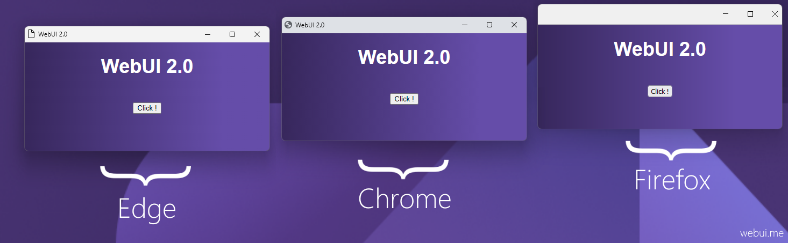

# V-Webinix

Use any web browser as GUI, with V, and HTML/JS/TS/CSS in the frontend.



## Features

- Fully Independent (*No need for any third-party library*)
- Lightweight (*~900 Kb*) & Small memory footprint
- Fast WS binary communication (*App--Webinix--Browser*)
- One header file
- Multi-platform & Multi-Browser
- Using private profile for safety

## Installation

Run ```v install malisipi.VWebinix``` or ```v install https://github.com/malisipi/vwebinix```

## Supported Browser

| OS | Browser | Status |
| ------ | ------ | ------ |
| Windows | Firefox | ✔️ |
| Windows | Chrome | ✔️ |
| Windows | Edge | ✔️ |
| Linux | Firefox | ✔️ |
| Linux | Chrome | ✔️ |
| macOS | Firefox | *coming soon* |
| macOS | Chrome | *coming soon* |
| macOS | Safari | *coming soon* |

### License

GNU General Public License v3.0

### Original Library

> This is just a wrapper written in/for V. Thanks to [Webinix](https://github.com/alifcommunity/webinix)
